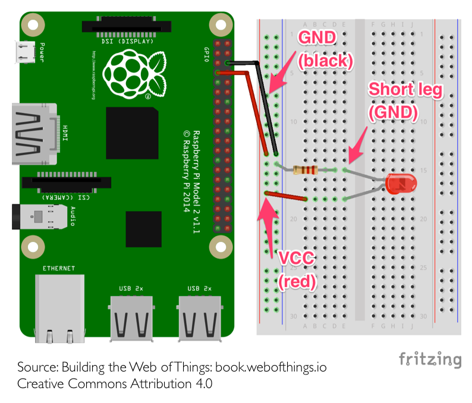

TP2
===
_infos pratiques_ : tous les raspberry ont pour login `pi` et pour mot de passe `raspberry`

1ère partie : Lancer le serveur node du TP précédent
----------------------------------------------------
. Connectez vous au raspberry à l'aide de la commande ssh:  

```
$ ssh pi@nom-du-raspberry.local
```  
Le nom du raspberry est sur la boîte en carton dans laquel il se trouvait.  
_Depuis Windows vous pouvez utiliser le logiciel "Putty" pour vous connecter à distance sur le raspberry. Par contre Windows ne reconnais pas les noms, il faudra donc utiliser l'adresse IP du raspberry_

. Récupérer le contenu du tp précédent via Git. (_créez au préalable un dossier pour votre binome dans lequel vous clonerez votre projet, utilisez pour cela les lignes de commandes vues au précéndent TP._)

. Lancez le serveur.  
_Rendez vous sur http://nom-du-raspberry.local:3000/_  
(rappel : Ctrl-C pour quitter une commande linux en cours)

**Pour éditer un fichier sous linux, nous allons utiliser le logiciel "nano", essayez d'ouvrir votre fichier server.js avec :**

```
$ nano server.js
```
(Ctrl-X pour quitter nano)

**Pour la suite nous allons avoir besoin d'un peu plus que quelques phrases retournées par notre serveur, pour cela nous allons utiliser un "moteur de template" : Mustache**  

. Installez mustache & mustache-express 

```
$ npm install mustache mustache-express --save
```

. créez une nouvelle hierarchie de dossier

```
votre_dossier/
	- server.js
	- public/ 
 	- views/ 
```
`server.js` => c'est votre code node.js pour lancer votre serveur.  
`public/` => c'est un dossier qui contient des fichiers accessibles directement depuis le serveur. On y range habituellement les fichiers javascript clients, les feuilles de styles css, et les images.  
`views/` => c'est le dossier où vous allez ranger les fichiers templates (les fichiers qui seront transformés en HTML à l'aide du moteur de template Mustache)  

Normalement vous devez également avoir un dossier `node_modules` et un fichier `package-lock.json`, n'y touchez pas, ils sont nécessaire pour le fonctionnement du serveur.

. créez un fichier `index.mustache` dans le dossier `views/` : 

```html
<html>
	<body>
		<h1>Hello with mustache</h1>
	</body>
</html>
```

et créez également un fichier `hello.mustache` dans le dossier `views/` : 

```html
<html>
	<body>
		<h1>Hello, {{ name }}</h1>
	</body>
</html>
```

. Modifiez votre fichier `server.js` de cette manière (faites des copier/coller uniquement pour les lignes nécessaire, si vous copier coller le contenu du code ci-dessous tel quel, cela ne compilera pas ;-) ): 

```js
const express = require('express')
const app = express()
const port = 3000
+++++++++Lignes à ajouter+++++++++++++
//OS est un utilitaire node qui va nous servir à afficher le nom de notre raspberry
const os = require("os");
//MustacheExpress est notre moteur de template
const mustacheExpress = require('mustache-express');
++++++++++++++++++++++++++++++++++++++

+++++++++Lignes à ajouter+++++++++++++
//Configuration du moteur de template
app.engine('mustache', mustacheExpress());
app.set('view engine', 'mustache');
app.set('views', __dirname + '/views');
++++++++++++++++++++++++++++++++++++++

+++++++++Lignes à ajouter+++++++++++++
//Ici on dit au serveur de servir les fichiers statiques depuis le dossier /public
app.use(express.static('public'))
++++++++++++++++++++++++++++++++++++++


//On retrouve le même comportement que notre serveur précédent
app.get('/', (request, response) => {
+++++++++Lignes à modifier+++++++++++++
  //Ici on indique que nous voulons transformer notre fichier index.mustache en HTML
  response.render('index');
++++++++++++++++++++++++++++++++++++++
})

app.get('/hello/:name', (request, response) => {
+++++++++Lignes à modifier+++++++++++++
  //De la même manière nous transformons notre fichier hello.mustache en HTML en passant des paramètres.
  response.render('hello', {name: request.params.name});
++++++++++++++++++++++++++++++++++++++
})

app.listen(port, (err) => {
  if (err) {
    return console.log('Erreur du serveur : ', err)
  }
+++++++++Lignes à modifier+++++++++++++
  //On utilise l'utilitaire OS pour récupérer le nom de notre raspberry.
  console.log('Le serveur écoute sur le port '+port+'\nRendez vous sur http://'+os.hostname()+'.local:'+port);
++++++++++++++++++++++++++++++++++++++
})
```

. Pour le moment notre serveur ne répond qu'à deux urls (`/`et `/hello/:name`). Créez une troisième "url" `/pooc` qui affiche une page HTML avec un peu de css.

. Sauvegardez votre travail sur Git.

2ème partie : Contrôle de LEDs
------------------------------

. Utilisation de la breadboard : 


. Réalisez ce montage :  
_Pour empêcher que la LED demande trop de courant au raspberry, on ajoute une résistance de 330 Ohms. Rappel du lycée, la loi d'Ohm : U = R * I. Pour fonctionner correctement notre LED a besoin de 10 mA, nous avons donc R(330) * I(0,010) = 3,3V, ce qui correspond à la tension envoyée par le raspberry_  

_Pour identifier la resistance, regardez les couleurs dessus, la 330 Ohm a les couleurs Orange, Orange, Marron_


. Dans un nouveau dossier `led` dans le dossier de votre binôme et installez `onoff` (un utilitaire node pour contrôler les GPIOs) et `sleep` (utilitaire node pour bloquer l'exécution d'un script) : 

```
$ npm install onoff sleep --save
```
 
. Dans ce même dossier, créez un fichier `led.js` : 

```js
const Gpio = require('onoff').Gpio;
const sleep = require('sleep');
//Création d'une variable qui va nous permettre d'accéder à un GPIO du raspberry  
//⚠️ Le nombre passé en paramètre correspond au numéro de GPIO et non au numéro de la pin.
const led = new Gpio(4, 'out');

console.log('Led On');
//On indique à la pin GPIO 4 que l'on veut envoyer du courant sur celle-ci
led.writeSync(1);
//On demande au script d'attendre 5 secondes
sleep.sleep(5);
//On dit à la pin GPIO 4 d'arrêter d'envoyer du courant.
led.writeSync(0);
console.log('Led Off');

//On indique qu'on a fini d'utiliser la pin GPIO 4.
led.unexport();
```

. Modifiez le script et le montage électronique pour allumer les deux LEDs du Kit.

3ème partie : LEDs & Web
------------------------
**Maintenant, nous allons lier le contrôle des LEDs avec notre serveur node.js**  

. Créer un nouveau dossier `server-led` dans le dossier de votre binôme, et installez toutes les dépendances nécessaire : 

```
$ npm install express mustache mustache-express onoff sleep --save
```

. Copiez le serveur node ainsi que sa hiérarchie dans ce dossier : 

```
$ cp [chemin du dossier]/server.js server.js
$ cp -r [chemin du dossier]/views/ views/
$ cp -r [chemin du dossier]/public/ public/
```
Vérifiez que votre copie fonctionne avec 

```
$ node server.js
```

. Une fois que votre serveur fonctionne, modifier `server.js` pour ajouter deux URLs : `/on` et `/off` qui respectivement allume et éteigne une LED.  

Vu que notre serveur ne se termine pas comme un script, on va intercepter la fin du processus (quand on utilise Ctrl-C pour quitter notre serveur par exemple) pour indiquer au système qu'on utilise plus les pins GPIOs.joutez à la fin du fichier `server.js` :

```js
process.on('SIGINT', () => {
  led.unexport();
});
```