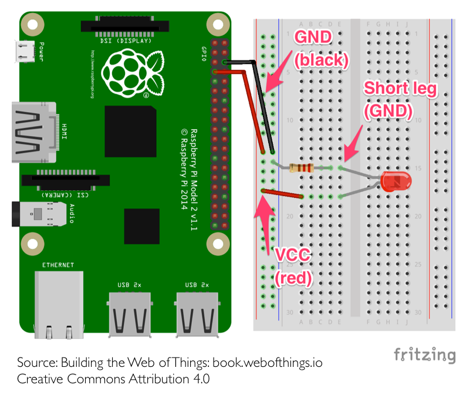

TP3
===
1ère partie : Contrôle de LEDs
------------------------------

. Utilisation de la breadboard : 


. Réalisez ce montage :  
_Pour empêcher que la LED demande trop de courant au raspberry, on ajoute une résistance de 330 Ohms. Rappel du lycée, la loi d'Ohm : U = R * I. Pour fonctionner correctement notre LED a besoin de 10 mA, nous avons donc R(330) * I(0,010) = 3,3V, ce qui correspond à la tension envoyée par le raspberry_  

_Pour identifier la resistance, regardez les couleurs dessus, la 330 Ohm a les couleurs Orange, Orange, Marron_


. Dans un nouveau dossier `led` dans le dossier de votre binôme et installez `onoff` (un utilitaire node pour contrôler les GPIOs) et `sleep` (utilitaire node pour bloquer l'exécution d'un script) : 

```
$ npm install onoff sleep --save
```
 
. Dans ce même dossier, créez un fichier `led.js` : 

```js
const Gpio = require('onoff').Gpio;
const sleep = require('sleep');
//Création d'une variable qui va nous permettre d'accéder à un GPIO du raspberry  
//⚠️ Le nombre passé en paramètre correspond au numéro de GPIO et non au numéro de la pin.
const led = new Gpio(4, 'out');

console.log('Led On');
//On indique à la pin GPIO 4 que l'on veut envoyer du courant sur celle-ci
led.writeSync(1);
//On demande au script d'attendre 5 secondes
sleep.sleep(5);
//On dit à la pin GPIO 4 d'arrêter d'envoyer du courant.
led.writeSync(0);
console.log('Led Off');

//On indique qu'on a fini d'utiliser la pin GPIO 4.
led.unexport();
```

. Modifiez le script et le montage électronique pour allumer les deux LEDs du Kit.

2ème partie : LEDs & Web
------------------------
**Maintenant, nous allons lier le contrôle des LEDs avec notre serveur node.js**  

. Créer un nouveau dossier `server-led` dans le dossier de votre binôme, et installez toutes les dépendances nécessaire : 

```
$ npm install express mustache mustache-express onoff sleep --save
```

. Copiez le serveur node ainsi que sa hiérarchie dans ce dossier : 

```
$ cp [chemin du dossier]/server.js server.js
$ cp -r [chemin du dossier]/views/ views/
$ cp -r [chemin du dossier]/public/ public/
```
Vérifiez que votre copie fonctionne avec 

```
$ node server.js
```

. Une fois que votre serveur fonctionne, modifier `server.js` pour ajouter deux URLs : `/on` et `/off` qui respectivement allume et éteigne une LED.  

Vu que notre serveur ne se termine pas comme un script, on va intercepter la fin du processus (quand on utilise Ctrl-C pour quitter notre serveur par exemple) pour indiquer au système qu'on utilise plus les pins GPIOs.joutez à la fin du fichier `server.js` :

```js
process.on('SIGINT', () => {
  led.unexport();
});
```