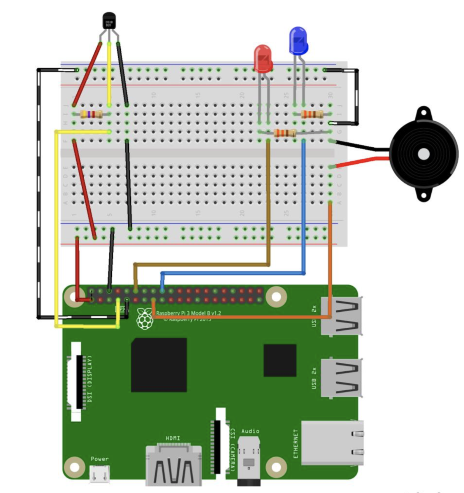
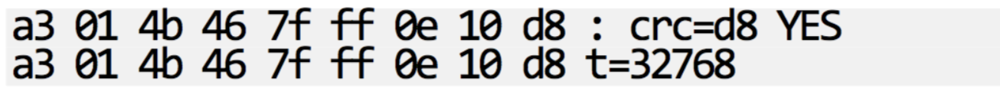

TP4
===
_infos pratiques_ : tous les raspberry ont pour login `pi` et pour mot de passe `raspberry`

1ère partie : Capteur de température
------------------------------------
_ne démarrez pas votre raspberry tout de suite, réalisez le montage avec le raspberry éteint._  

. Réalisez ce montage : (**⚠️ sans les LEDs ni le buzzer ⚠️**)  
**Pour le capteur de température, faites bien attention aux couleurs des fils**  
*la résistance qui va intervenir pour le capteur de température est une résitstance de 4,7 kOhm, c'est celle qui est différente des deux autres, elle porte les couleurs Jaune, Violet, Rouge*

. Pour vérifier que votre montage correspondant au capteur de température est correcte, nous allons vérifier que le système reconnait bien notre capteur :  
- Démarrez le raspberry  
- Connectez-vous au raspberry  
- Affichez la liste des appareils connectés :  

```
$ ls /sys/bus/w1/devices
```
_Cette commande devrait vous afficher un dossier commençant par 28-XXXXXX (les X étant une longue série de caractères). C'est dans ce dossier que le capteur de température va écrire ses données_  
- Visualisez les données remontées par le capteur avec la commande : 

```
$ cat /sys/bus/w1/devices/28-XXXXXXXX/w1_slave
```
_Remplacez les X par ce que vous avez eu lors de la précédente commande._  
- Vous devriez avoir comme résultat quelque chose de ce type : 

_La température remontée par votre capteur est le nombre en bas à droite, divisez celui-ci par 1000 pour avoir la temérature en degrées celcius._  

. Dans le dossier de votre binôme (créez-en un nouveau si vous n'en avez pas), créez un nouveau dossier s'intitulant `temperature` (sans accent), et allez dans ce dossier. 

. Installez l'utilitaire node qui va nous servir pour communiquer avec le capteur :  

```
$ npm install ds18b20 --save
```
_en réalité cet utilitaire va simplement lire dans le fichier que l'on a affiché précédemment_  

. créez un fichier `temperature.js` :

```js
//On initialise notre utilitaire node pour communiquer avec le capteur 
//(capteur = sensor en anglais)
const sensor = require('ds18b20');
//Identifiant de notre capteur, remplacez les X par ce que vous avez eu précédemment.
const sensorId = '28-xxxxxxxxx';
//On lit la température en provenance du capteur.
var temperature = sensor.temperatureSync(sensorId);
//On affiche dans le terminal la température.
console.log('La température est de ' + temperature);
```

. éxécutez le script : `node temperature.js`

2ème partie : Web & température
-------------------------------

. En vous aidant de ce que vous avez vu dans les TPs précédents, créez un serveur node.js qui affichera la température courante.  
Faites en sorte d'afficher un message personnalisé suivant la température _(exemple : si T° < 15° => il fait froid, 15 < T° < 30 => ça peut aller, T° > 30° => Il fait chaud.)_  

. Une fois ce premier serveur terminé, Ajoutez les deux LEDs sur votre montage (un peu comme sur le shéma plus haut), et faite en sorte d'allumer la led bleu quand il fait trop froid (ex < 15°) et la led rouge quand il fait trop chaud (> 30°).
s